<h1 align="center">Hola 👋, soy Marcelo Escobar</h1>

<h3 align="center">Persona versátil y con la capacidad de trabajar en equipo, caracterizandome por mi responsabilidad, proactividad y entusiasmo. Poseo buenos conocimientos en programación, buscando desarrollarme profesionalmente en mi pasión.</h3>

- 🌱 Estoy aprendiendo **Desarrollo de videojuegos en Godot Engine** y **Ingeniería Inversa**.

- 📫 Contáctame en **themarceloitinegocios@gmail.com**.

- 📁​ Más detalles sobre mis habilidades en mi <a href="https://themarceloyt.github.io/" target="_blank">página</a>.

<h3 align="left">Conecta conmigo:</h3>

<h3 align="left">Lenguajes y herramientas:</h3>

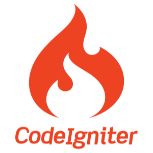

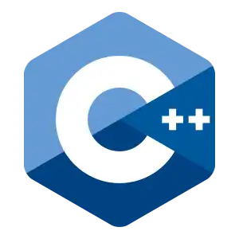

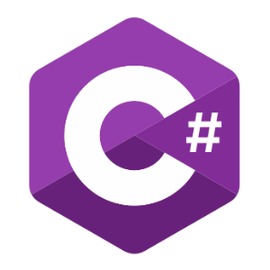

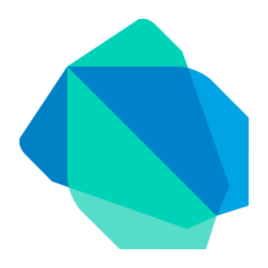

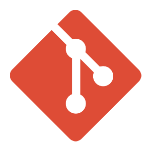

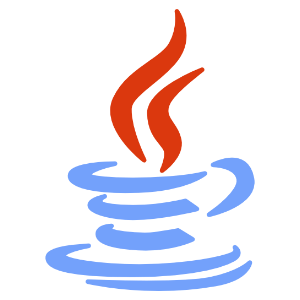

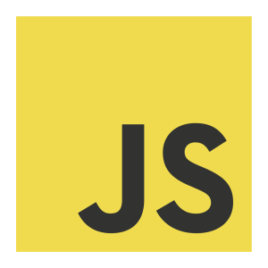

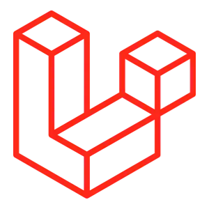

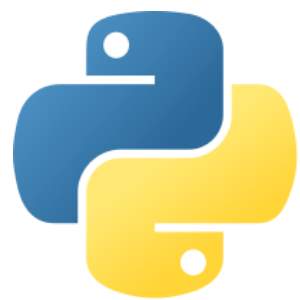

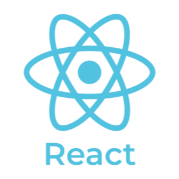

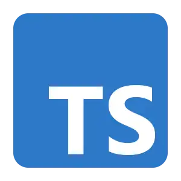

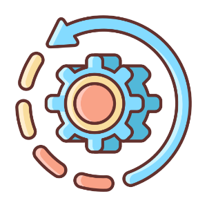

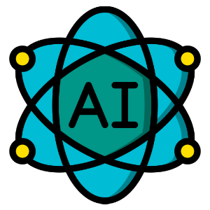

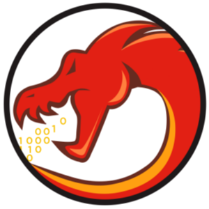

